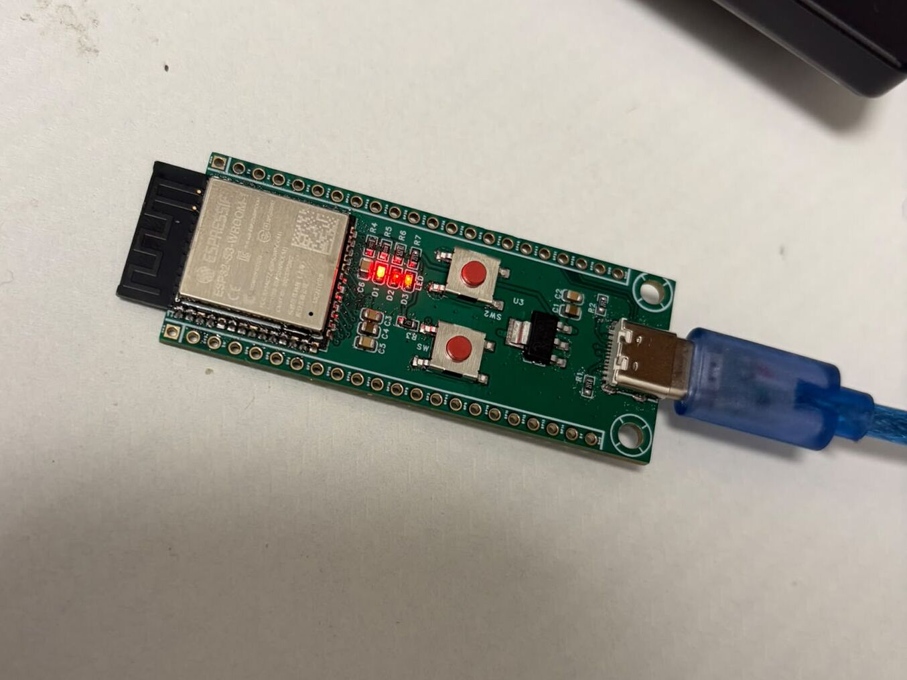

# ESP32-S3 Custom Development Board

> This repository is a working record of a custom ESP32-S3 board.
> It keeps the source files, design changes, test notes, and open work.

## Record status

| Item | Current record |
|---|---|
| Board revision | v3 |
| Main module | ESP32-S3-WROOM-1-N16R8 |
| PCB | 4 layers, 1.6 mm finished thickness |
| CAD source | EasyEDA Pro project archive |
| Board state | Assembled board photo is available |
| Test state | Some bring-up results are recorded; more tests are open |

This is not a claim that every test is complete. Read the [engineering record](docs/engineering-record.md) for the details.

## What this board is

This board is a small ESP32-S3 development board. It has:

- ESP32-S3-WROOM-1-N16R8
- USB-C power and native USB
- 3.3 V LDO power
- GPIO0 BOOT button
- EN/RESET button
- GPIO21 status LED
- Two 1×22 headers with 2.54 mm pitch
- Four-layer PCB routing

## Start here

1. Read the [engineering record](docs/engineering-record.md).
2. Open the [EasyEDA Pro source](hardware/easyeda/esp32s3-devkit-v3.epro2).
3. View the [schematic PDF](hardware/schematic/esp32s3-v3-schematic.pdf).
4. Check the [PCB layout image](hardware/renders/esp32s3-v3-pcb-layout.png).
5. Read the [EasyEDA source notes](hardware/easyeda/README.md).

The `.epro2` file is the editable source. PDF, PNG, Gerber, and STEP files are exports. Use them to view or make the board. Do not use them as the main source.

## Revision record

| Revision | Main change | Record result |
|---|---|---|
| v1 | Two-layer Eagle board with narrow power traces | Brownout and reset problems were recorded during radio activity |
| v2 | EasyEDA version with new power and USB work | USB, power, reset, and antenna problems were recorded |
| v3 | Four-layer EasyEDA board | Better power routing, corrected USB mapping, longer EN delay, and multi-layer antenna keep-out |

The full change notes are in the [engineering record](docs/engineering-record.md).

## Current test record

| Test | Status | Evidence in this repository |
|---|---|---|
| 3.3 V rail | Reported in the project record | No saved measurement log yet |
| Native USB Serial/JTAG | Reported in the project record | No saved host log yet |
| GPIO21 LED | Reported in the project record | Firmware is included |
| Wi-Fi scan | Open | Firmware is included; board test is not recorded |
| Cold continuity checks | Open | Bring-up list is in the engineering record |
| Rail scope check during radio activity | Open | No scope capture is included |
| ERC and DRC report | Not recorded | No report is included |
| Full production release check | Open | Do not treat this repository as a production release |

## Important layout notes

- GPIO19 is USB D-.
- GPIO20 is USB D+.
- The USB pair uses 8 mil trace width and 6 mil spacing in the recorded layout.
- The pair targets 90 Ω differential impedance. This target is not a measured result.
- L2 is the ground reference below the USB pair.
- The ESP32-S3 antenna area is cleared on all four board layers.
- GPIO0 is a boot strap pin. Check the pin before connecting external circuits.
- GPIO19 and GPIO20 are shared with USB. External loads can affect USB.

## Files

| File | Use |
|---|---|
| [`hardware/easyeda/esp32s3-devkit-v3.epro2`](hardware/easyeda/esp32s3-devkit-v3.epro2) | Editable EasyEDA Pro source |
| [`hardware/schematic/esp32s3-v3-schematic.pdf`](hardware/schematic/esp32s3-v3-schematic.pdf) | Schematic for reading |
| [`hardware/bom/esp32s3-v3-bom.xlsx`](hardware/bom/esp32s3-v3-bom.xlsx) | Bill of materials |
| [`hardware/gerber/esp32s3-v3-gerbers.zip`](hardware/gerber/esp32s3-v3-gerbers.zip) | PCB manufacturing files |
| [`hardware/mechanical/esp32s3-v3.step`](hardware/mechanical/esp32s3-v3.step) | 3D board model |
| [`hardware/renders/esp32s3-v3-pcb-layout.png`](hardware/renders/esp32s3-v3-pcb-layout.png) | PCB layout view |
| [`hardware/renders/esp32s3-v3-render.png`](hardware/renders/esp32s3-v3-render.png) | 3D board view |
| [`firmware/arduino/blink_and_scan/blink_and_scan.ino`](firmware/arduino/blink_and_scan/blink_and_scan.ino) | LED, USB, and Wi-Fi test |

## Firmware test

The Arduino sketch does three things:

1. blinks the GPIO21 LED;
2. prints messages over USB serial at 115200 baud;
3. starts a Wi-Fi scan every 15 seconds.

The Wi-Fi result is still open. A sketch in the repository does not prove that the assembled board passed the test.

## How to add a record entry

For each hardware change, record:

- date and revision;
- what changed;
- why it changed;
- what file or measurement supports it;
- result;
- next check or open question.

Keep one change in one Git commit when possible. Use a clear commit message. This makes the board history easier to read.

Use the template at the end of [`docs/engineering-record.md`](docs/engineering-record.md).

## License

The current [`LICENSE`](LICENSE) file covers the software and documentation. It does not clearly set a license for the PCB files. Add a hardware license before making a final open-hardware claim.
